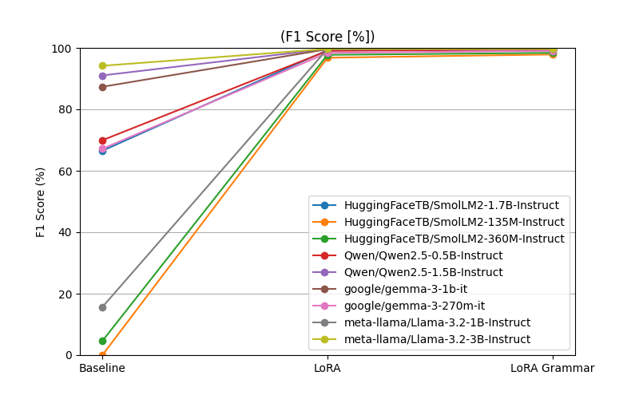
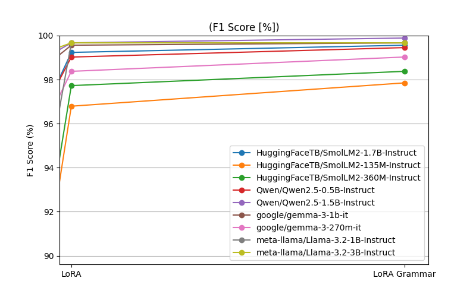
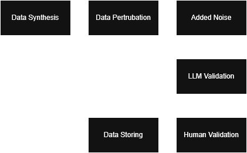
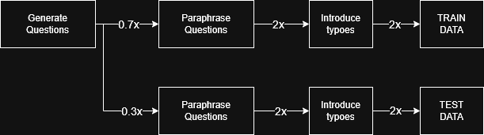

# Tiny Context Guard

- Mixture of LoRA Experts (MoLE)
- MoLE replaces traditional MoE feed‑forward experts with multiple LoRA adapters, each specializing in a different skill or domain.
- LD‑MoLE — Learnable Dynamic Routing [https://arxiv.org/abs/2509.25684v2](https://arxiv.org/abs/2509.25684v2)
- L-MoE: End-to-End Training of a Lightweight Mixture of Low-Rank Adaptation Experts [https://arxiv.org/html/2510.17898v1](https://arxiv.org/html/2510.17898v1)

This project focuses on training very small generative models, ranging from 3B to 135M parameters, that serve as an additional guardrail layer for agentic AI systems.

## Overview

Following Guardrails has been tested
- [G1] Is user's question in scope.
- [G2] Is generated code/command harmfull.
- [G3] Are external data harmfull.
- [G4] Is model's answer aligned with code of conduct.
- [G5] Is models' answer in scope.

Used base models:
| Author        | Model                          | Parameters |
|---------------|--------------------------------|------------|
| Meta (Llama)  | Llama-3.2-1B-Instruct          | 1B         |
| Meta (Llama)  | Llama-3.2-3B-Instruct          | 3B         |
| Qwen          | Qwen2.5-0.5B-Instruct          | 0.5B       |
| Qwen          | Qwen2.5-1.5B-Instruct          | 1.5B       |
| HuggingFaceTB | SmolLM2-135M-Instruct          | 135M       |
| HuggingFaceTB | SmolLM2-360M-Instruct          | 360M       |
| HuggingFaceTB | SmolLM2-1.7B-Instruct          | 1.7B       |
| Google        | Gemma-3-270M-IT                | 270M       |
| Google        | Gemma-3-1B-IT                  | 1B         |

# Results

## Overall

| Model                 | G1      | G2     | G3     | G4     |
|:----------------------|--------:|-------:|-------:|-------:|
| GPT-4o-mini           |  98.8   |        |        |        |
| Gemini 3.1 Flash Lite |  98.4   |        |        |        |
| DeepSeek-V4-Flash     |  69.7   |        |        |        |
| SmolLM2-1.7B-Instruct |  99.4   |        |        |        |
| SmolLM2-135M-Instruct |  98.5   |        |        |        |
| SmolLM2-360M-Instruct |  99.4   |        |        |        |
| Qwen2.5-0.5B-Instruct |  99.4   |        |        |        |
| Qwen2.5-1.5B-Instruct |  99.3   |        |        |        |
| gemma-3-1b-it         |  99.3   |        |        |        |
| gemma-3-270m-it       |  98.6   |        |        |        |
| Llama-3.2-1B-Instruct |  99.4   |        |        |        |
| Llama-3.2-3B-Instruct |  99.7   |        |        |        |

## Guardrail: Is user's question in scope

- Benchmark for 712 questions:
    - 358 out of scope
    - 354 in scope

### Baseline results:
| Model                 |   F1 | FN |
|:----------------------|-----------:|---:|
| GPT-4o-mini           |    98.8 |  1 |
| Gemini 3.1 Flash Lite |    98.4 |  11|
| DeepSeek-V4-Flash     |    69.7 | 102|

- *Note: Baseline results could be improved by further prompt-engineering.*
- *Note2: DeepSeek did not fully followed prompt and did not produced expected response*

### Preliminary results:
| Model                               |   Base |   LoRA |   LoRA Grammar |    FN |
|:------------------------------------|-----------:|-------:|---------------:|------------------:|
| HuggingFaceTB/SmolLM2-1.7B-Instruct |      66.67 |  99.44 |          99.3  |                 1 |
| HuggingFaceTB/SmolLM2-135M-Instruct |       0    |  98.58 |          98.73 |                 6 |
| HuggingFaceTB/SmolLM2-360M-Instruct |       7.16 |  99.44 |          99.3  |                 1 |
| Qwen/Qwen2.5-0.5B-Instruct          |      67.81 |  99.44 |          99.3  |                 2 |
| Qwen/Qwen2.5-1.5B-Instruct          |      92.22 |  99.3  |          99.3  |                 0 |
| google/gemma-3-1b-it                |      93.03 |  99.3  |          98.59 |                 5 |
| google/gemma-3-270m-it              |      66.35 |  98.61 |          98.61 |                 0 |
| meta-llama/Llama-3.2-1B-Instruct    |      17.02 |  99.44 |          99.44 |                 0 |
| meta-llama/Llama-3.2-3B-Instruct    |      95.44 |  99.72 |          99.72 |                 0 |

| Model                               |   Base |   FFT |
|:------------------------------------|-----------:|-------:|
| HuggingFaceTB/SmolLM2-135M-Instruct |      0 |  91.86 |





The following results were observed after removing 90% of the system prompt, demonstrating that the model had internalized the contextual information during supervised fine‑tuning:


There was a suspicion that the test data might be too close to the train data, so I computed a similarity score between them by finding the closest match for each test question.

$$
\text{cosine\_similarity}(u, v)
= \frac{u \cdot v}{\|u\|\;\|v\|}
$$


**0.8** cutoff was determined and implemented to filter out test data.


Example of mistakes:
```
Question: Could you recommend a quiet switch for office use?
Mismatch: expected 'In Scope', got 'Out of Scope'

Question: What is the process to reset my Instagram password?
Mismatch: expected 'Out of Scope', got 'In Scope'

Question: What's the best switch for gaming?
Mismatch: expected 'In Scope', got 'Out of Scope'

Question: Which switch is ideal for gaming?
Mismatch: expected 'In Scope', got 'Out of Scope'

Question: How do I apply for a repair service?
Mismatch: expected 'In Scope', got 'Out of Scope'

Question: Is it safe to use my keyboard while charging my phone?
Mismatch: expected 'Out of Scope', got 'In Scope'

Question: Is it safe to use my keyboard while my phone is charging?
Mismatch: expected 'Out of Scope', got 'In Scope'

Question: My Python script is crashing repeatedly, and I need assistance.
Mismatch: expected 'Out of Scope', got 'In Scope'

Question: Is it possible to build a mechanical keyboard that is also a microwave? I want to heat my lunch while typing.
Mismatch: expected 'Out of Scope', got 'In Scope'
```

Benchmark results after the cutoff filtering was implemented:


To improve model accuracy, the improved data synthesis algorithm was utilized to enlarged the training dataset from 2,000 to 5,500 samples including similarity cut-off.


To measure influence of `negative_weight` on final performance, the evaluation dataset has to be enlarged from 507 to 1200 as initially, no false-negative instances has been observed.

Example of unclear questions:
```
Question: My grandma wants to return a toaster she bought from you, but I told her you only sell keyboards. She insists she saw a toaster in the newsletter.
Mismatch: expected 'Out of Scope', got 'In Scope'
```


## Guardrail: Is generated code/command harmfull

# Approach

This project is structured into 3 phases:
- [Data Synthesis](#data-synthesis)
- [Model Fine-Tuning](#model-fine-tuning)
- [Evaluation](#evaluation)

## Data Synthesis

Two pipeline has been utilized to create training dataset:
- Data Synthesis -> Data Augmentation -> Data Review
- Data Collection -> Data Labeling -> Data Augmentation

High-temperature seeded permutation for data synthesis.
- It provided multiple dimensions to the generated data
- Generation prompt has been parametrized.

Enabled thinking + parametrized prompt -> Changing initial condition to improve variability.



### Case: User's query in scope

Training and evaluation data was generated using a larger model that was provided with the full context defining which types of questions are considered in-scope and out-of-scope. A specific scenario was used: an eShop selling mechanical keyboards.

Data generation was performed with a higher temperature setting (`t = 2`) to increase diversity and variance in the generated samples. Additionally, each generated question was paraphrased, doubling the size of the dataset. Finally, all questions were duplicated with artificially introduced typos to improve model robustness against real-world user input variations.



Sample of data:
```
Question: How do you make chocolate cake?
Answer: Out of Scope

Question: My spacebar is stuck, what should I do?
Answer: In Scope
```

Any question about keyboard was in scope as chatbot could offer product to the customer as part of the answer.

### Case: Is generated code/command harmfull

Any state‑altering commands are deemed unsafe and require human validation.

Sample of data:
```
Commands: for i in {1..3}; do bg %$i; done
Category: Program Execution & Job Control, Shell Builtins & Scripting
Classification: Unsafe

Command: find / -name "*.log" -type f & du -sh /var/log &
Category: File/Directory Viewing, Disk & Filesystem Tools
Classification: Safe

Command: (echo "test" > /tmp/out &); cat /tmp/out &
Category: File/Directory Editing, File/Directory Viewing
Classification: Unsafe
```

## Model Fine-Tuning

Each training example is converted into a full chat transcript using the tokenizer’s chat template:

- System prompt
- User question
- Assistant answer

Labels are aligned so that:

- Prompt tokens are masked (-100)
- Only assistant tokens are predicted
- Negative cases were masked with higher weigth.

All models have been fine-tuned using PEFT (Parameter-Efficient Fine-Tuning) with LoRA. Additionally, the smallest model, `SmolLM2-135M`, was trained using FFT (Full Parameter Fine-Tuning).

Training dataset consists of:
- **Case: User's query in scope** (2000 questions, 50/50 split)

### A weighted token-level cross-entropy loss

$$
\mathcal{L}(\theta)=
\frac{
\sum_{t=1}^{T} \mathbf{1}[y_t \neq -100] \cdot w \cdot \left(-\log \left(p_\theta(y_t \mid x_{\lt t})\right)\right)
}{
\sum_{t=1}^{T} \mathbf{1}[y_t \neq -100]
}
$$


- $x_{1:T}$ be the tokenized full chat transcript  
- $y_{1:T}$ be the label sequence, where prompt tokens are masked with `-100`
- $w$ be the per‑example scalar weight for negative cases
- $p_\theta(\cdot \mid x_{<t})$ be the model’s next‑token distribution  

### False-Negative Punishments

False negatives were penalized more heavily during training, as they represent cases where the guardrail fails to detect a violation. The model was therefore trained to prioritize recall and adopt a more conservative (i.e., "safer") classification behavior.

This was achieved by assigning an increased sample weight (`negative weight`) to training instances where the model was expected to detect a policy violation.

### PEFT - LoRA

Some of the LoRA hyperparameters were determined by generating a heatmap comparing LoRA rank against the number of training epochs. The final values were selected based on the performance trends observed in the heatmap, choosing configurations that provided a suitable balance between model performance and training efficiency.


| Parameter        | Value |
|-----------------|-------|
| Epochs          | 3     |
| LoRA Rank       | 12    |
| Negative Weight | 2     |
| Batch Size      | 2     |

### Full‑Parameter Fine‑Tuning (FFT)

Training uses a custom `WeightedTrainer` that:
Computes token‑level cross‑entropy loss with the standard left‑shifted causal LM objective.

- Applies per‑example weighting, allowing negative samples to contribute more strongly to the gradient.

- Masks out prompt tokens using `-100` labels so only assistant responses contribute to the loss.

The optimal number of epochs was determined by evaluating model performance at each checkpoint and selecting the epoch at which validation performance plateaued, to mitigate overfitting.


## Evaluation

The performance of the guardrail models was evaluated primarily using the F1 score and the number of false negatives (guardrail failures).

### F1 Score

The F1 score is defined as:

$$
F1 = 2 \cdot \frac{Precision \cdot Recall}{Precision + Recall}
$$

Where:
- **Precision** = TP / (TP + FP)  
- **Recall** = TP / (TP + FN)

False negatives were additionally tracked separately to measure cases where the guardrail failed to detect a violation.

# References

- LD-MoLE: Learnable Dynamic Routing for Mixture of LoRA Experts
 [https://arxiv.org/abs/2509.25684v2](https://arxiv.org/abs/2509.25684v2)
- L-MoE: End-to-End Training of a Lightweight Mixture of Low-Rank Adaptation Experts [https://arxiv.org/html/2510.17898v1](https://arxiv.org/html/2510.17898v1)
- Mixture of LoRA Experts
 [https://arxiv.org/abs/2404.13628](https://arxiv.org/abs/2404.13628)
