# Tiny Context Guard

This project focuses on training very small generative models, ranging from 135M to 3B parameters, that serve as a defence in depth for agentic system.
Initial idea was to implement MoLE (Mixture of LoRA Experts) that monitors context window and LLM generated actions to flag potential issues.

My main motivation was to have long safe agentic sessions that runs on my main computer.

MoLE replaces traditional MoE feed‑forward experts with multiple LoRA adapters, each specializing in a different skill or domain. There are multiple techniques how to implement MoLE, for example:
- Original MoLE proposal from Apr 2024 [https://arxiv.org/abs/2404.13628](https://arxiv.org/abs/2404.13628)
- LD‑MoLE - Learnable Dynamic Routing [https://arxiv.org/abs/2509.25684v2](https://arxiv.org/abs/2509.25684v2)
- L-MoE: Lightweight Mixture of Low-Rank Adaptation Experts [https://arxiv.org/html/2510.17898v1](https://arxiv.org/html/2510.17898v1)
- LoRA-Mixer: Coordinate Modular LoRA Experts Through Serial Attention Routing [https://arxiv.org/abs/2507.00029](https://arxiv.org/abs/2507.00029)
- HDMoLE: Hierarchical Routing and Dynamic Thresholds [https://arxiv.org/abs/2409.19878](https://arxiv.org/abs/2409.19878)

While the original MoLE introduced the idea of merging LoRA adapters as a foundation, later approaches started to refine how the experts are selected and combined. LD-MoLE and HDMoLE moved away from simple fixed “Top-K” selection and instead use more dynamic ways to decide how many experts to activate. L-MoE takes a different route and focuses on blending experts continuously rather than picking discrete ones. LoRA-Mixer goes even further by integrating the expert selection directly into the attention mechanism itself, making the whole process more efficient and tightly coupled with the model’s internal computation.

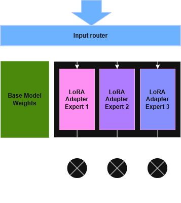

## Project Overview

Plan is to develop a MoLE system that focuses on following guardrails:
- [G1] Is user's question in scope?
- [G2] Is models' answer in scope?
- [G3] Is chain-of-thoughts aligned?
- [G4] Is model's answer aligned with code of conduct.
- [G5] Are external data harmfull? (safe to add into context)
- [G6] Is generated code/command harmfull?

## Used Models

| Author        | Model                          | Parameters |
|---------------|--------------------------------|------------|
| Meta (Llama)  | Llama-3.2-1B-Instruct          | 1B         |
| Meta (Llama)  | Llama-3.2-3B-Instruct          | 3B         |
| Qwen          | Qwen2.5-0.5B-Instruct          | 0.5B       |
| Qwen          | Qwen2.5-1.5B-Instruct          | 1.5B       |
| HuggingFaceTB | SmolLM2-135M-Instruct          | 135M       |
| HuggingFaceTB | SmolLM2-360M-Instruct          | 360M       |
| HuggingFaceTB | SmolLM2-1.7B-Instruct          | 1.7B       |
| Google        | Gemma-3-270M-IT                | 270M       |
| Google        | Gemma-3-1B-IT                  | 1B         |

The instruct variants of the models were chosen because they already include a prompt template, making it straightforward to generalize both the training and benchmarking process.

# Dataset Synthesis

No external dataset was used, instead both the training and evaluation data were synthetically generated to better match and tailor the dataset to each specific use case.

Data synthesis pipeline had 5 stages:
1. Initial data synthesis
2. Data augmentation
3. Data review
4. Similarity filtering
5. Data noising

I used a larger model with a high temperature ($t = 2$) and a detailed, dynamic prompt to generate a broad and diverse dataset. I also introduced “seeded” and “parameterized” prompts to further increase variation and randomness in the generated data.


## Initial Data Synthesis

For the initial data synthesis, a very detailed system prompt with strictly defined policies was required. The first use case focused on a chatbot assistant for a keyboard eShop and the G1 task (determining whether a user’s query is in scope). The prompt included a full description of the eShop, detailed information about each page, products, payments, and related functionality. It also defined clear policies for what is considered in scope and out of scope.

Example:
```
**In Scope questions** are those a mechanical keyboard eShop employee could reasonably answer. This includes:
- Mechanical keyboards, keyboard building, customization, components, accessories
- Switches, keycaps, layouts, plates, PCBs, stabilizers, cases, cables, tools

**Out of Scope questions** are those where the topic is completely unrelated to keyboards, the eShop, its products, services, or customer support.
```

Additionally, to ensure the dataset covered a wide range of possible user queries, the prompt was parameterized. Around 50 different categories of questions that a customer might ask were defined, and the LLM was instructed to generate for example batch of 50 in-scope questions for each specific category. This approach ensured that each topic was explored in isolation, resulting in comprehensive coverage of all potential in-scope questions.

Example:
```
### Current Run Config
- During this run, focus only on questions for category: {CATEGORY}
```

With this approach, around 3000 in-scope questions has been generated and splitted into (2500 train / 500 evaluation).

Similar approach was taken also for out-of-scope questions.

Output:
```
{"question": "I need help picking switches for a 75% keyboard with a wooden case. I want a deep sound but not too heavy. Any suggestions?", "answer": "In Scope"}

{"question": "How to grow tomatoes indoors?", "answer": "Out of Scope"}
```

## Data Augmentation

To further expand the dataset and improve the robustness of the SLM, the existing data was duplicated using an LLM that paraphrased each question into different styles while preserving its exact meaning.

For Example:
```
Question: Can I change my payment method from bank transfer to credit card for order #4567?

Question: Yo, possible to switch the payment method for order #4567 from a bank transfer to a credit card?
```

## Data Review

It is crucial to ensure that the generated dataset is clean and correctly classified. However, manual review of everything was not feasible, so I used three different LLMs to perform the classification. I then only manually reviewed cases where their predictions disagreed or did not match the original dataset labels.

In this step, edge cases were raised by LLM and those were used to further refine the policy defining what is considered in-scope.

For example of some edge cases:
```
Question: Is it possible to build a mechanical keyboard that is also a microwave? I want to heat my lunch while typing.

Question: Is it safe to use my keyboard while my phone is charging?

Question: How do I clean keyboard?

Question: My spacebar is stuck, what should I do?

Question: Can I track a UPS package without a tracking number?

Question: Do you sell desks?

Question: My grandma wants to return a toaster she bought from you, but I told her you only sell keyboards. She insists she saw a toaster in the newsletter.
```

## Similarity Filtering

There was a concern that the test data might be too similar to the training data, so I computed a similarity score by finding the closest match for each test question, by creating embeding vector via `sentence-transformers/all-MiniLM-L6-v2` and then calculating consine similarity:

$$
\text{cosine similarity}(u, v)
= \frac{u \cdot v}{\|u\|\|v\|}
$$


Some test questions were found to be too similar to the training data. Therefore, a similarity cutoff of **0.8** was introduced to filter them out. The final test dataset is shown below:


## Data Noising

Later, I will showcase the weaknesses of the SLM, where it was observed that its performance is sensitive to grammatical errors, typos, and poor sentence structure.

To compensate for this, noising algorithm was created to introduce multiple types of errors:
- swap adjacent letters
- drop a character
- duplicate character
- keyboard neighbor substitution

Additionally multiple types of levels noise was created:
```
0x - can u tell me if the gateron milky yellows are in stock rn?
2x - can u tell me if the gatern milky yellows ae in stock rn?
4x - can u tell me if th gateron mioky yellows aree in stoock r?
6x - cam u telll m if the gsteron miilky yelows are in stock r?
```

The dataset was further duplicated by introducing randomly varying levels of noise into the questions.

Final used dataset was:
- 9397 train data
- 1200 test data

# Training

Each training example is converted into a full chat transcript using the tokenizer’s chat template. The dialogue is structured into three standard roles:
- **System**: The guardrail policy and instructions
- **User**: The incoming query or content
- **Assistant**: The expected guardrail classification (e.g., safe or unsafe)

Labels are carefully aligned during dataset preparation to ensure the model only learns to generate the classification, not to memorize the prompts:
- **Prompt Masking**: All system and user tokens are masked out by assigning them a label of `-100`, which the cross-entropy loss function ignores.
- **Target Prediction**: Only the assistant's tokens (the actual classification) are predicted.
- **Special Tokens**: The tokenizer's chat template natively handles BOS/EOS tokens to accurately mark the boundaries between the prompt and the assistant's response.

## Training Methods

All models have been fine-tuned using Parameter-Efficient Fine-Tuning (PEFT) with LoRA, with the exception of the smallest model (`SmolLM2-135M`), which was attempted to train using Full Parameter Fine-Tuning (FFT) to maximize its limited capacity.

For the LoRA-tuned models, adapters were attached to the key attention projection modules (`q_proj`, `k_proj`, `v_proj`, `o_proj`) with a rank ($r$) of 8, 12, 16 and an alpha ($\alpha$) of 16. Gradient checkpointing was enabled across all training runs to optimize memory consumption.

## A Weighted Token-Level Cross-Entropy Loss

To train the models, I employed a modified cross-entropy loss function that applies per-example scalar weights. This allows the trainer to dynamically scale the loss based on the severity (described in next chapter) of the case:

$$
\mathcal{L}(\theta)=
\frac{
\sum_{t=1}^{T} \mathbf{1}[y_t \neq -100] \cdot w \cdot \left(-\log \left(p_\theta(y_t \mid x_{< t})\right)\right)
}{
\sum_{t=1}^{T} \mathbf{1}[y_t \neq -100]
}
$$

Where:
- $x_{1:T}$ is the tokenized full chat transcript.
- $y_{1:T}$ is the label sequence, where prompt tokens are masked with `-100`.
- $w$ is the per‑example scalar weight applied to specific classifications (described in next chapter)
- $p_\theta(\cdot \mid x_{<t})$ is the model's next‑token distribution.

### False-Positive Punishments

In the context of safety guardrails, false positives (cases where the guardrail fails to detect a genuine policy violation) are much more dangerous than false negative (flagging benign content). To address this asymmetry, false positives were penalized more heavily during training. 

This was achieved by assigning an increased sample weight ($w=4.0$) to training instances where the model was expected to output a negative (violating) label.

By multiplying the token-level loss by this weight, the model is aggressively penalized for missing violations. Consequently, the model is trained to prioritize recall and adopt a more conservative, "safer" classification behavior, reducing the likelihood of malicious queries slipping through.

I was wondering which weight value should be chosen to minimize false positive rate without degrading overall performance:
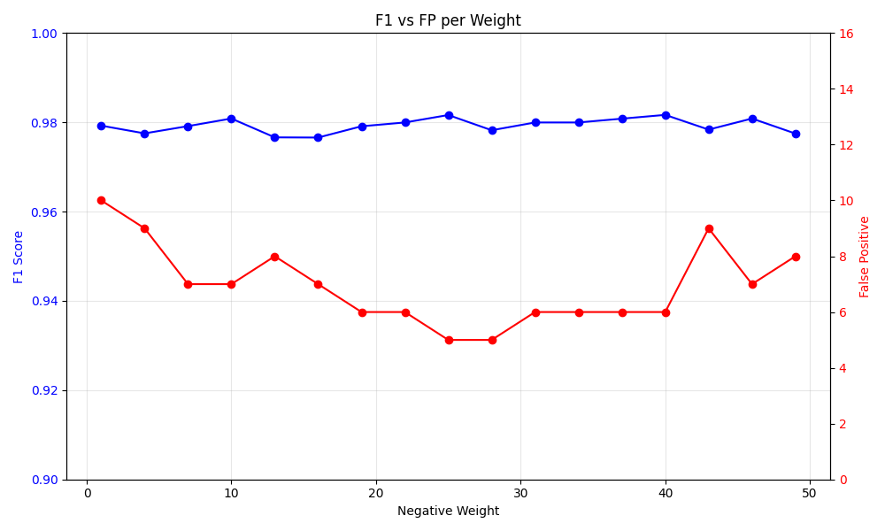

## PEFT - LoRA

LoRA hyperparameters were determined by generating a heatmap comparing LoRA rank against the number of training epochs. The final values were selected based on the performance trends observed in the heatmap, choosing configurations that provided a suitable balance between model performance and training efficiency.


Additionally, I was curious whether it is possible to overtrain the `HuggingFaceTB/SmolLM2-135M-Instruct` model, so I ran training for 100 epochs and performed a benchmark after each epoch.

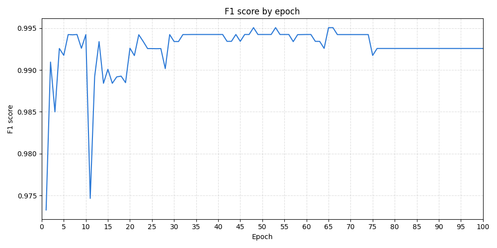

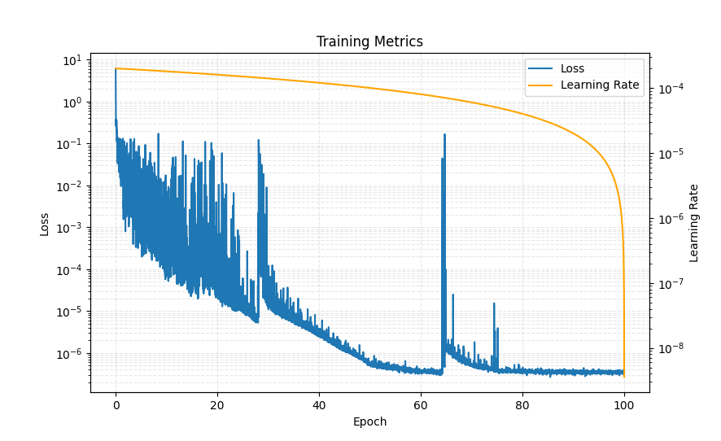

## Full‑Parameter Fine‑Tuning (FFT)

Full‑Parameter Fine‑Tuning was attempted for the smallest model `HuggingFaceTB/SmolLM2-135M-Instruct` to measure if it can perform better than just training it via LoRA:

100 epoch, with `batch_size=10` consumed 10GB of VRAM and took 5 hours.
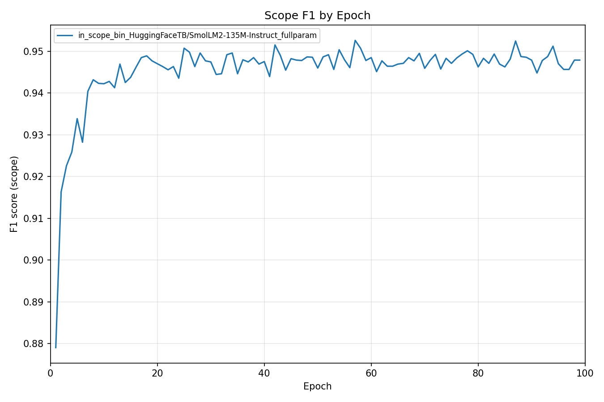

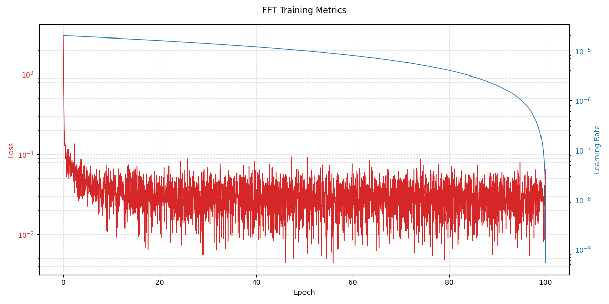

However, the performance never reached that observed with LoRA.

## General training stats

The following table provides a summary of the training resource consumption, comparing the models by training time and peak VRAM requirements.

| Hyperparameter | Value |
|----------------|-------|
| LoRA Epochs    | 1     |
| LoRA Rank      | 12    |
| Negative Weight| 25     |
| Batch Size     | 2     |
| Learning Rate  | 2e-4  |

| Model                                 | VRAM Peak (MB) | Train Time (s) |
| ------------------------------------- | -------------: | -------------: |
| `HuggingFaceTB/SmolLM2-135M-Instruct` |          508   |          480   |
| `HuggingFaceTB/SmolLM2-360M-Instruct` |          975   |          522   |
| `HuggingFaceTB/SmolLM2-1.7B-Instruct` |         3577   |          357   |
| `Qwen/Qwen2.5-0.5B-Instruct`          |         1589   |          399   |
| `Qwen/Qwen2.5-1.5B-Instruct`          |         3614   |          474   |
| `meta-llama/Llama-3.2-1B-Instruct`    |         3007   |          258   |
| `meta-llama/Llama-3.2-3B-Instruct`    |         6862   |          460   |
| `google/gemma-3-270m-it`              |         1616   |          372   |
| `google/gemma-3-1b-it`                |         3084   |          507   |

Surprisingly, the training time is very similar across all models. However, for smaller models such as the 135M model, the batch size can be increased to 10, reducing the training time to approximately 60s per epoch for the price of increasing VRAM requirement to `~8GB`.

# Evaluation

The performance of the guardrail model was evaluated using two main metrics: the **F1 score** and the number of **False Positives** (guardrail failures).

## F1 Score

The F1 score is defined as:

$$
F1 = 2 \cdot \frac{Precision \cdot Recall}{Precision + Recall}
$$

where:

* **Precision** = TP / (TP + FP)
* **Recall** = TP / (TP + FN)

The F1 score provides a balanced measure of precision and recall, making it suitable for evaluating binary classification tasks.

In addition to the F1 score, the number of **False Positives** was tracked separately, as these represent cases where the guardrail failed to detect a violation. Since such failures can allow unsafe or out-of-scope requests to pass through, minimizing false negatives is particularly important for guardrail systems.

# Results

## Inference Requirements

The table below summarizes the VRAM requirements and inference speed of each model.

| Model                                 | VRAM Peak (MB) | Total Time (s) | Avg/Sample (s) |
| ------------------------------------- | -------------: | -------------: | -------------: |
| `HuggingFaceTB/SmolLM2-135M-Instruct` |          268.9 |          662.0 |          0.599 |
| `HuggingFaceTB/SmolLM2-360M-Instruct` |          705.9 |          701.3 |          0.635 |
| `HuggingFaceTB/SmolLM2-1.7B-Instruct` |         3295.2 |          407.4 |          0.369 |
| `Qwen/Qwen2.5-0.5B-Instruct`          |          954.8 |          590.6 |          0.535 |
| `Qwen/Qwen2.5-1.5B-Instruct`          |         2961.3 |          683.2 |          0.618 |
| `meta-llama/Llama-3.2-1B-Instruct`    |         2376.9 |          391.8 |          0.355 |
| `meta-llama/Llama-3.2-3B-Instruct`    |         6157.0 |          660.1 |          0.597 |
| `google/gemma-3-270m-it`              |          524.3 |          698.3 |          0.632 |
| `google/gemma-3-1b-it`                |         1920.9 |         1074.7 |          0.973 |


## Baseline Results:

| Model                 |   F1 | FP |
|:----------------------|-----------:|---:|
| GPT-4o-mini           |    98.8 |  1 |
| Gemini 3.1 Flash Lite |    98.4 |  11|
| DeepSeek-V4-Flash     |    69.7 | 102|

- *Note: Baseline results could be improved by further prompt-engineering.*
- *Note2: DeepSeek did not fully followed prompt and did not produced expected response*

## Preliminary results:


| Model                               | Base F1 (%) | LoRA F1 (%) | LoRA FP |
| :---------------------------------- | ----------: | ----------: | ------: |
| meta-llama/Llama-3.2-1B-Instruct    |       46.63 |       99.50 |       2 |
| meta-llama/Llama-3.2-3B-Instruct    |       77.82 |       99.18 |       7 |
| Qwen/Qwen2.5-0.5B-Instruct          |       67.26 |       99.10 |      10 |
| Qwen/Qwen2.5-1.5B-Instruct          |       72.43 |       99.25 |       3 |
| HuggingFaceTB/SmolLM2-1.7B-Instruct |       33.46 |       99.83 |       2 |
| HuggingFaceTB/SmolLM2-360M-Instruct |        5.52 |       99.26 |       4 |
| HuggingFaceTB/SmolLM2-135M-Instruct |        0.00 |       99.17 |       5 |
| google/gemma-3-270m-it              |       52.40 |       98.68 |      11 |
| google/gemma-3-1b-it                |       62.20 |       99.26 |       5 |


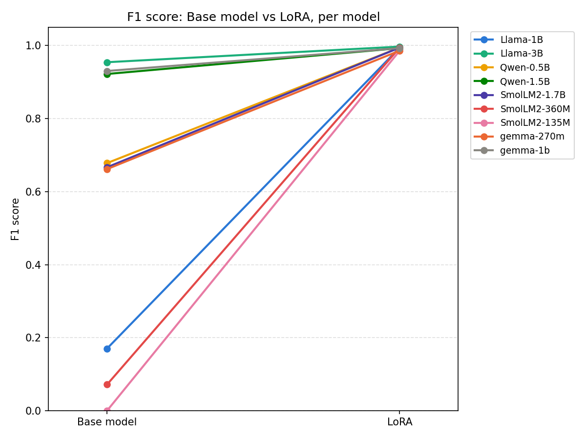

## Ommiting System Prompt

I was wondering whether a system prompt is necessary for a single-purpose classification LoRA adapter, so I ran training and benchmarking under three setups: a full system prompt, a redacted system prompt, and no system prompt at all. The goal was to evaluate whether the system prompt could be simplified or removed to speed up inference.

30 epoch training run:
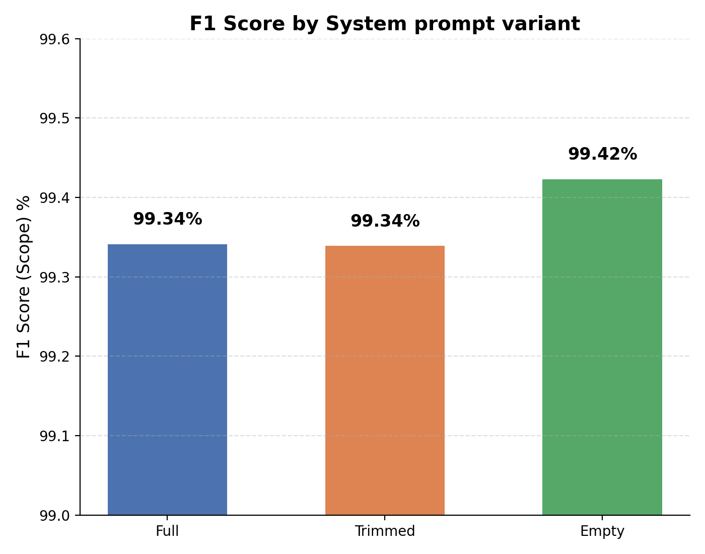

SLM can learn its instruction and policies just from the training data.

## Similarity Score Cut-off effect

The following charts show how the performance evaluation changed after applying a similarity score cut-off on the validation data. It is expected that performance will decrease as the model becomes more accurate on evaluation data that is very similar to the test data.


To improve model accuracy back to its previous level, an improved data synthesis algorithm was used to expand the training dataset from 2,000 to 5,500 samples, while also incorporating the similarity cut-off. It clearly slows that more training data improves the accuracy.


## Effect of Dataset Size on Performance

```
TBD
```

## Robustness to Noise

A comparison of the fine-tuned `HuggingFaceTB/SmolLM2-135M-Instruct` model trained on clean data shows that performance degrades significantly as noise increases in the input data.

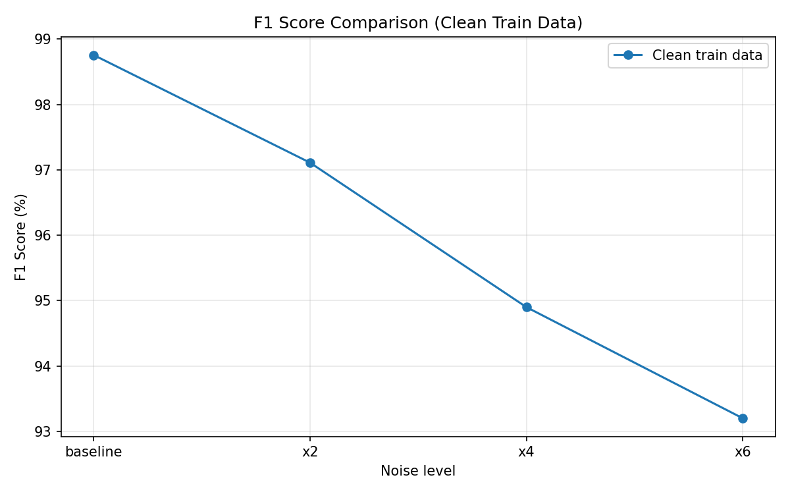

The following chart shows that, after duplicating the training data and applying randomly varying noise levels from 1× to 4×, the model’s initial performance remained stable while its robustness improved.

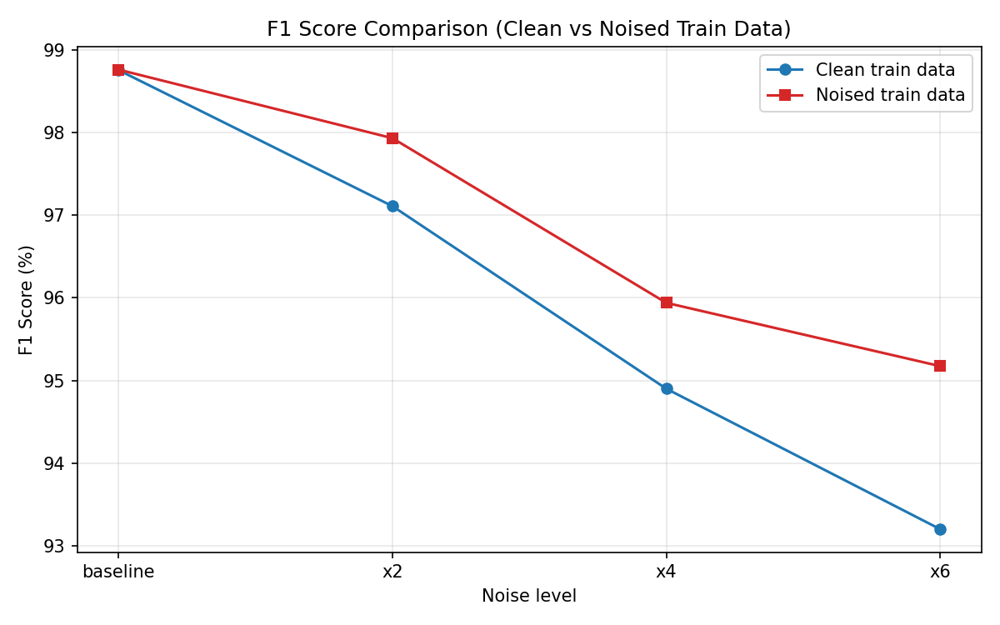

The following chart illustrates differences between models trained on clean data, showing that larger models are generally more robust to noise.

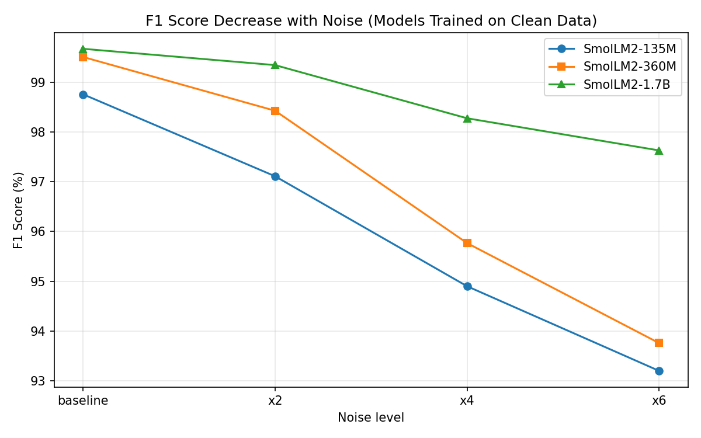

Lastly, the chart below shows performance differences when larger models were also trained on the noisy dataset. Interestingly, the performance of the larger model decreased under these conditions.

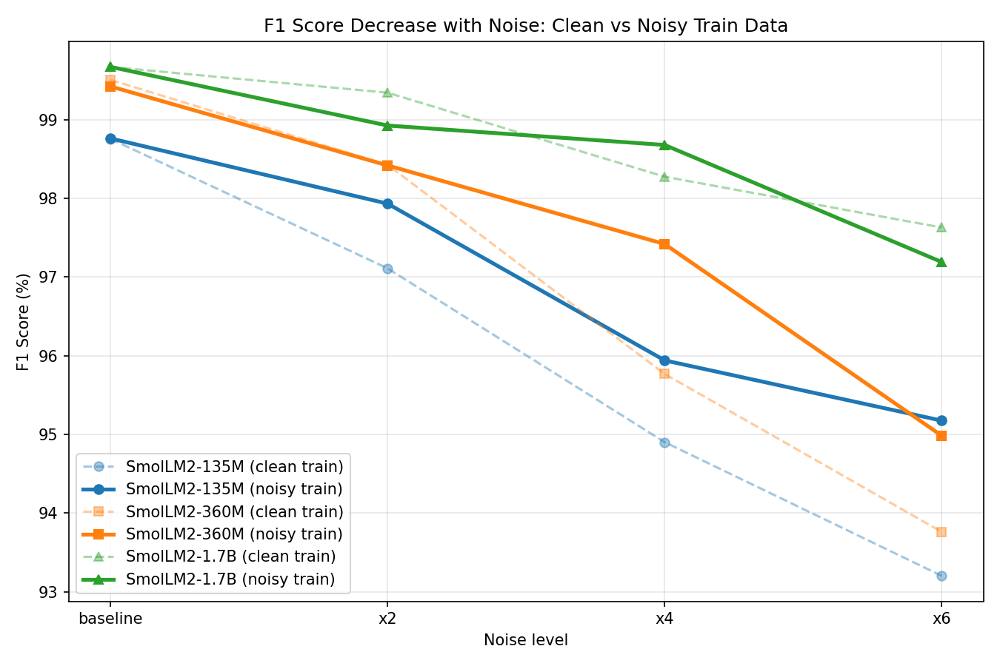

## Multilingual Performance

SmolLM2 models are English-first, so when we feed them German, we are basically testing how far their pretraining generalization and token overlap can carry them.

I was wondering what their performance would be in different languages and whether any solution is needed to compensate.

I used the `google-t5/t5-3b` model to translate the test data from English into German, French, and Romanian. The smallest model showed a performance drop of around 20–30%, while larger models exhibited progressively smaller degradation in performance.

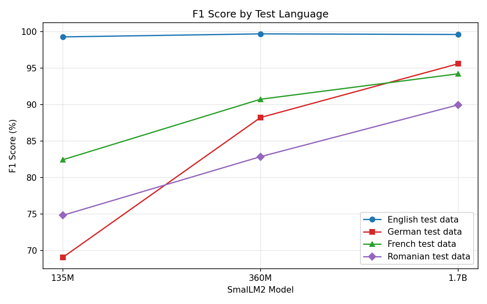

So, how do we compensate?

### Approach 1: Multilanguage LoRA Adapters

I again used `google-t5/t5-3b` model to translate both train and test dataset into all 3 languages: German, French and Romanian.

Which improved the performance drastically, back to 95%+ F1 zone:

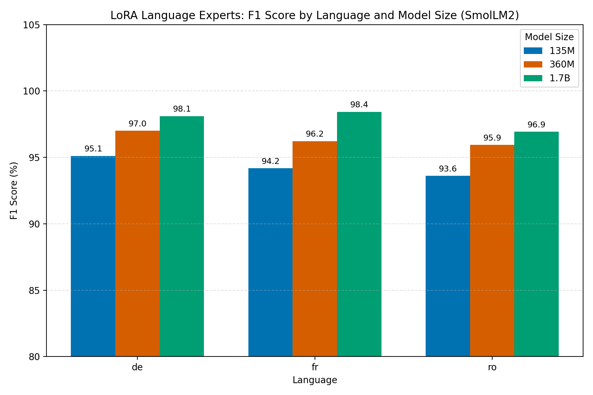

### Approach 2: Translation On the Fly

Using the default English LoRA adapter, I additionally introduce a translation model that converts user queries into English first. This approach requires running two models in parallel, but it has a significant advantage: it can be applied universally across all guardrails, eliminating the need to train separate adapters for each language.

The key question is how translation might affect the original meaning of the user’s queries.

```
Run in progress...
```

# Lesson Learned

- Training: make the code resumable at checkpoints as long training session may need to be paused or interrupted.
- Every customization should be verified by benchmark as a sanity check.


